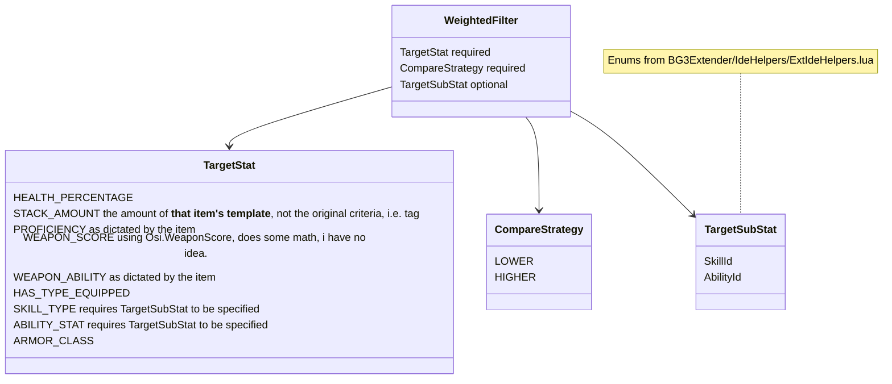

# "Automatic" Inventory Manager (AIM)
Emphasis on the air quotes.

### Disclaimer
This mod isn't actually particular useful from a functionality standpoint thanks to Larian's Magic Pockets and Filter implementation - if you're looking at this mod because you think you need to move items and gear to a character before you can use them, or because you don't know about the built-in filters and have trouble finding items, then you'll be happy to know that Larian has largely solved these problems already. Play around! 

This mod is more targeted at people like me who hate the giant, messy inventories but also hate swapping between characters to pick up items/constantly right-click "send to"ing, or who play on things like Steam Deck and have trouble identifying items just based on icons.

## Quick Tips
Configurations are generated at `%localappdata%\Larian Studios\Baldur's Gate 3\Script Extender\Automatic_Inventory_Manager` - this contains the config.json, log.txt, and all the item filters under `filters\` - if you're seeing weird behavior after an update or after installing/uninstalling a mod that extends this mod, you can just nuke the whole folder and AIM will regenerate with defaults + what your other installed mods add.

## config.json 

All these values are stored in the [PersistentVars](https://github.com/Norbyte/bg3se/blob/main/Docs/API.md#persistent-variables) of each save, alongside the generated ItemMaps

| Property Name (case sensitive) | value(s) | default | 
|--------------|-----------|-----------|
| ENABLED | 0 for disabled, 1 for enabled | 1 |
| FILTER_TABLES | array of files in `filters\` to load - case-sensitive. Leave off the .json | `["Equipment", "Roots", "Weapons", "RootPartial", "Tags" ]` |
| LOG_LEVEL | `TRACE = 5, DEBUG = 4, INFO = 3, WARNING = 2, ERROR = 1, OFF = 0` | 3 |
| RESET_CONFIGS | 1 if you want to completely reinitialize, as if you had deleted the folder (but doesn't wipe out mod-added `filters\` files | 0 |
| SORT_ITEMS_ON_LOAD | 1 if you want to execute items when you load a save, 0 if you just want it to happen when picking up an item | 1 |
| SYNC_CONFIGS | 1 to update the PersistentVars with the config.json values on each load, 0 otherwise | 1 |
| SYNC_FILTERS | 1 to update the PersistentVars with the `filters/` file values (as identified by FILTER_TABLES, 0 otherwise | 1 |

## How and when does this mod even work?

There are two main aspects to this mods functionality: ItemFilters, and FilterProcessors (no, i don't like these names either).

### Item Filters
Each file in `filters\` contains a .json file representing Lua tables (known internally as ItemMaps) with the following structure:
```
{
  "ITEM_KEY": {
    ItemFilter: {
      Filters : [
        { Filter }
      ],
      Modifiers: [
        { Modifier }
      ]
  }
}
```

Each file name represents a different category of criteria used to identify an item that can be processed by a FilterProcessor - for example, Tags.json represents Ext.Entity.Tags values (in their human readable, case-sensitive, forms, AIM translates to the GUID during processing) that an item must have to be processed, and Weapons.json is for items that `Osi.IsWeapon` returns `1` for.

This is done primarily for organization and secondarily for efficiency reasons, to avoid looping a million times on every item, as we can sometimes somewhat intelligently guess which ItemMap to inspect based on criteria like `Osi.IsWeapon` or `Osi.IsEquipable`. It also makes merging in multiple sources of ItemMaps (like from third-party mods) a heck of a lot easier, and limits the damage a third-party ItemMap can cause.

#### ItemFilter
An ItemFilter is a table that represents all the instructions that the FilterProcessors must process to determine the correct target. AIM implements the following instructions:
- Filters
- Modifiers

##### Filters
A list, ordered in priority with 1 being the highest priority, of instructions that "filter" down the set of possible targets down to the lowest possible amount. 

After each filter is evaluated, if there's more than one possible target still leftover, then the next filter will be processed. If all filters have been processed and there's still more than one possible target, a random target will be chosen.

There are two variations of Filters that are currently implemented:

<details>
<summary>Weighted Filters</summary>
Inspects and compares the value of a specific stat on the eligible party members, using the Compare Strategy to determine the "winner"



For example, Tags contains the following entry:
```json
	"LOCKPICKS" : 
	{
		"Filters" : 
		{
			"1" : 
			{
				"CompareStategy" : "HIGHER",
				"TargetStat" : "SKILL_TYPE",
				"TargetSubStat" : "SleightOfHand"
			},
			"2" : 
			{
				"CompareStategy" : "HIGHER",
				"TargetStat" : "STACK_AMOUNT"
			}
		}
	},
```
This uses two WeightedFilters: the highest priority is Skill Type, the second highest is Stack Amount. When an item using the `LOCKPICK` tag is picked up, it will be processed by a FilterProcessor using this filter, which will first find the party member(s) with the highest SleightOfHand skill value - if multiple party members have the same highest value, then the amount of lockpicks in each party member's inventory will be compared and a winner chosen based on that.

So if your party is setup with the following data:
| Party Member | Sleight Of Hand Skill | Number of Lockpicks in Inventory |
|--------------|-----------------------|----------------------------------|
| Lae'Zel | 10 | 0 |
| Tav | 14 | 0 |
| Astarian | 22 | 10 |
| Shadowheart | 22 | 0 |

Then Astarian and Shadowheart will pass the SKILL_TYPE filter, but only Astarian will pass the STACK_AMOUNT filter, causing Astarian to receive the item. 

(IMPORTANT NOTE: STACK_AMOUNT checks the item's template in each inventory, not the original criteria that caused this filter to be chosen. So, if a lockpick is processed because it has the `LOCKPICK` tag, only Lockpicks will be considered - not Trap Disarm Tools or any other item with the `LOCKPICK` tag)

If Shadowheart and Astarian both had 10 lockpicks in their inventory, one of them would be randomly chosen.
</details>

<details>
<summary>Targeted Filters</summary>
  Used to identify one specific target to send the item to - this can be the original party member that picked up the item, a different party member, the camp chest, or a container, but not a character that isn't in the active party.

  ```mermaid
classDiagram
    TargetFilter --> Target
    
    class TargetFilter{
        Target required
    }

    
    class Target {
        originalTarget that picked up the item
        GUIDSTRING 
        camp
    }
    note for Target "GUIDSTRING represents a party member, i.e. S_Player_Laezel_58a69333-40bf-8358-1d17-fff240d7fb12, or container"
  ```

For example, Tags contains the following entries:
```json
	"CAMPSUPPLIES" : 
	{
		"Filters" : 
		[
			{
				"Target" : "camp"
			}
		]
	},
	"SCROLL" : 
	{
		"Filters" : 
		{
			"1" : 
			{
				"CompareStategy" : "HIGHER",
				"TargetStat" : "STACK_AMOUNT"
			},
			"2" : 
			{
				"Target" : "originalTarget"
			}
		}
	},
```

When any item with the tag `CAMPSUPPLIES` is processed, it will be sent straight to the camp chest, no further evaluation needed.

When any item with the tag `SCROLL` is processed, it will first be run through the WeightedFilter for STACK_AMOUNT, and if multiple party members hold the same amount of the scroll, or if nobody currently has this scroll in their inventory, then the character that originally picked up the item will be chosen (this is done to prevent the user from having to search for the scroll if nobody currently has one in their inventory)
</details>

##### Modifiers

This generally serves as a generic catch-all for any kind of special rules that the FilterProcessors should consider when choosing a target - currently, only the `STACK_LIMIT` modifier is implemented, which pre-filters out party members if they contain more than the specified limit, unless all party members exceed it, in which case nobody is filtered out. 

A purely internal modifier of Encumberence is implemented as well - this is automatically applied to every item being processed, and pre-filters out party members if receiving the item would make them encumbered, unless all party members would be encumbered.
