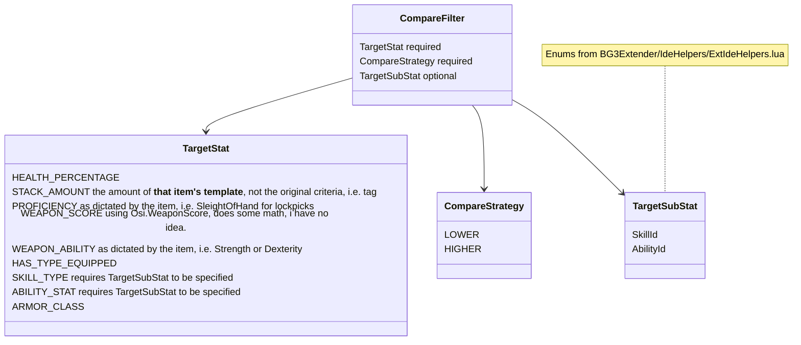

# "Automatic" Inventory Manager (AIM)
If you process the world in if statements, then oh boy, is this the mod for you!

### Disclaimer
This mod isn't actually particular useful from a functionality standpoint thanks to Larian's Magic Pockets, multi-select, and Filter implementations - if you're looking at this mod because you think you need to move items and gear to a character before you can use them, or because you don't know about the built-in filters and have trouble finding items, or because you don't know you can select multiple items in your inventory by shift-clicking, then you'll be happy to know that Larian has largely solved these problems already. Play around! 

This mod is more targeted at people like me who hate the giant, messy inventories for aesthetic but also hate swapping between characters to pick up items/constantly right-click "send to"ing, or who find the interface way too busy to manage (especially when playing on small monitors or Steam Deck). 

Additionally, I have no idea what'll happen in a true multiplayer game - never tested it. According to Norbyte, praise be his name, [single player sessions are really just multiplayer sessions, Milhouse-style](https://github.com/Norbyte/bg3se/blob/main/Docs/API.md#client-server), so it should maybe work fine? File an issue with **_EXACT DETAILS, LOGS, AND A ZIP OF YOUR `filters\` DIRECTORY_** if you have, well, issues. Otherwise, disable this mod using the config.json.

## Quick Tips
Configurations are generated at `%localappdata%\Larian Studios\Baldur's Gate 3\Script Extender\Automatic_Inventory_Manager` - this contains the config.json, log.txt, and all the Item Maps under `filters\` - if you're seeing weird behavior after an update or after installing/uninstalling a mod that extends this mod, you can just nuke the whole folder and AIM will regenerate with defaults + what your other installed mods add.

## config.json 

⚠ PersistentVar functionality has been disabled as of 1.1.0 due to bad implementation (sorry) - will reeanable in the future when I implement a way for users to control syncing per save, in-game, rather than through the config.json ⚠
~~All these values are stored in the [PersistentVars](https://github.com/Norbyte/bg3se/blob/main/Docs/API.md#persistent-variables) of each save, alongside the generated ItemMaps.~~

The default configs for this branch have been uploaded to [./default_configs](./default_configs/) in case of issues with creating them - still attempting to triage this.

The default configs for this branch have been uploaded to ./default_configs in case of issues with creating them - still attempting to triage this.

| Property Name (case sensitive) | value(s) | default | 
|--------------|-----------|-----------|
| ENABLED | 0 for disabled, 1 for enabled. Just disables the processing and tagging of items, configs will still be processed and synced (see SYNC_* properties) | 1 |
| FILTERS_DIR | specifies where the itemMap json files should live relative to `%localappdata%\Larian Studios\Baldur's Gate 3\Script Extender\Automatic_Inventory_Manager` - exposed for my own convenience | `filters` |
| FILTER_TABLES | array of files in `filters\` to load - case-sensitive. Leave off the .json. If creating a new ItemMap file without registering it through the API (so just adding the .json to the directory), it needs to be added here to be picked up. Any itemMaps added through the API will be automatically added. | `["Equipment", "Roots", "Weapons", "RootPartial", "Tags" ]`|
| LOG_LEVEL | `TRACE = 5, DEBUG = 4, INFO = 3, WARNING = 2, ERROR = 1, OFF = 0` <br/>HIGHLY recommended to leave at INFO or below, as writing logs is extremely performance intensive and if you have any items with stack counts in the hundreds or thousands, like gold, it will appear as though your game is frozen. Only increase this if you're actively debugging an issue for a select item.<br/>Any logs above INFO level (debug/trace) will not be logged to console, and will only be sent to the log.txt, due to the sheer amount of information.| 2 |
| RESET_CONFIGS | `1` if you want to completely reinitialize, as if you had deleted the folder (but doesn't wipe out mod-added `filters\` files | 0 |
| SORT_ITEMS_ON_LOAD | `1` if you want to execute items when you load a save<br/>`0` if you just want it to happen when picking up an item | 1 |
| ~~SYNC_CONFIGS~~ | ⚠ TEMPORARILY DISABLED - SEE TOP OF [#config.json](#configjson) ⚠ ~~1 to update the PersistentVars with the config.json values on each load, 0 otherwise~~ | 1 |
| MERGE_DEFAULT_FILTERS | ⚠ CHANGED 1.1.0 from SYNC_FILTERS, with different behavior ⚠ <br/>`1` to sync the default filters AIM has with the files in `filters/{FILTER_TABLES}`<br/>`0` to only use what's currently in the files (this will prevent you from getting new filters through AIM, but will ensure any customizations you make are preserved.) | 1 |

#### MERGE_DEFAULT_FILTERS
To expand on `MERGE_DEFAULT_FILTERS` more, if enabled, AIM will attempt to merge what's present in the json files with what it has in-memory (the defaults) - this merge has the following rules:
1. If AIM knows about itemMaps that aren't listed in `FILTER_TABLES`, add them to the config 
1. If there are new filters in the {itemMap}.json, pull those in at the listed priority, reducing the priority of AIM's default filters if there's a conflict (meaning, if you add a filter to Tags.json - CONSUMABLE with priority 99, and AIM already has a filter for CONSUMABLE with priority 99, AIM will set your filter to priority 99 and its filter to priority 100)
1. If we already know about your filter, ignore it (doesn't matter if the priority is different, AIM prioritizes its own for technical implementation reasons - will attempt to improve in the future)

This merge has the following weakness currently:
- If you remove a filter in the .json file that AIM has in-memory, or remove an itemMap from `FILTER_TABLES`, AIM will add it back. 
  - This is because AIM can't currently tell the difference between a filter or itemMap that was added in a recent release, and a filter that always existed, but was deleted by the mod user. Will attempt to improve this functionality in the future.

Therefore, if you want to make changes to the default filters and want to ensure they are always preserved, and are fine with AIM not automatically adding new filters or itemMaps, then you should set MERGE_DEFAULT_FILTERS to 0 so that the `filters/` files completely replace the AIM defaults. You can still manually merge in new filters if desired by checking out [./default_configs](./default_configs/) - it will be updated with changes when applicable.

## How and when does this mod even work?

### When?
Items will be processed when being added directly to a party member's inventory - this includes picking up, transferring between party members, pulling out of containers. This does not include items being added to a container in the party member's inventory.

To prevent constant reprocessing, a custom tag, `Public/Automatic_Inventory_Manager/Tags/AIM_PROCESSED.lsx` is added to each item that is evaluated by AIM, regardless of whether it was eligible for sorting. This tag can be cleared by dropping the item, allowing it to be re-processed on pickup. 

Additionally, each item in the party's inventory with the `CONSUMABLE` tag will be re-processed on use, when outside of combat (meaning, if you drink a small health potion, all small health potions in the party's inventory will be redistributed according to the filters). Specifically done outside of combat to avoid any potential weirdness with magic pockets + action economy, and to prevent users from searching for potions while managing combat.

### How?

There are two main aspects to this mods functionality: ItemFilters, and FilterProcessors (no, i don't like these names either).

### Item Maps
Each file in `filters\` contains a .json file representing Lua tables (known internally as ItemMaps) with the following structure:
```
{
  "ITEM_KEY": {
    ItemFilter: {
      Filters : [
        { Filter }
      ],
      Modifiers: [
        { Modifier }
      ]
  }
}
```

Each file name represents a different category of criteria used to identify an item that can be processed by a FilterProcessor - for example, Tags.json represents Ext.Entity.Tags values (in their human readable, case-sensitive, forms, AIM translates to the GUID during processing) that an item must have to be processed, and Weapons.json is for items that `Osi.IsWeapon` returns `1` for.

This is done primarily for organization and secondarily for efficiency reasons, to avoid looping a million times on every item, as we can sometimes somewhat intelligently guess which ItemMap to inspect based on criteria like `Osi.IsWeapon` or `Osi.IsEquipable`. It also makes merging in multiple sources of ItemMaps (like from third-party mods) a heck of a lot easier, and limits the damage a third-party ItemMap can cause.

AIM-implemented ItemMaps:
- Run on every item:
  - Tags, using `Ext.Entity.Tag.Tags` and translated using `Ext.StaticData`.
  - Roots, using the rootTemplate GUIDSTRING
  - RootPartial, leverages Lua's string.find on the rootTemplate GUIDSTRING (for those items that all belong to one category, but don't have a Tag or other Entity value to identify them as such, e.g. Books (WHY ARE ALL SCROLLS TAGGED AS BOOKS LARIAN щ(゜ロ゜щ))
- Conditional
  - Weapons, using `Osi.IsWeapon`
  - Equipment, using `Osi.IsEquipable`
 
All ItemMaps can also include the entry `ALL` to identify filters that should be run for all items of that category - e.g. Weapons uses ALL to run the same filters against all weapons, but not all equipment

#### ItemFilter
An ItemFilter is a table that represents all the instructions that the FilterProcessors must process to determine the correct target. AIM implements the following instructions:
- Filters
- Modifiers

##### Filters
A list, ordered in priority with 1 being the highest priority, of instructions that "filter" down the set of possible targets down to the lowest possible amount. 

After each filter is evaluated, if there's more than one possible target still leftover, then the next filter will be processed. If all filters have been processed and there's still more than one possible target, a random target will be chosen.

The filter priority can be arbitrarily high, to communicate that a given filter should be considered after any other filters found in different ItemFilters. For example, Tags contains the entry `CONSUMABLE` which has a CompareFilter for `STACK_AMOUNT` set at priority 99, and the entry `HEALING_POTION` with two WeightFilters at priorities 1 and 2 - that way, all healing potions, which have both tags, only execute the `CONSUMABLE` filter if the `HEALING_POTION` filters can't isolate a single target.

There are two variations of Filters that are currently implemented:

<details>
<summary>Compare Filters</summary>
Inspects and compares the value of a specific stat on the eligible party members, using the Compare Strategy to determine the "winner"



For example, Tags contains the following entry:
```json
	"LOCKPICKS" : 
	{
		"Filters" : 
		{
			"1" : 
			{
				"CompareStategy" : "HIGHER",
				"TargetStat" : "SKILL_TYPE",
				"TargetSubStat" : "SleightOfHand"
			},
			"2" : 
			{
				"CompareStategy" : "HIGHER",
				"TargetStat" : "STACK_AMOUNT"
			}
		}
	},
```
This uses two CompareFilters: the highest priority is Skill Type, the second highest is Stack Amount. When an item using the `LOCKPICK` tag is picked up, it will be processed by a FilterProcessor using this filter, which will first find the party member(s) with the highest SleightOfHand skill value - if multiple party members have the same highest value, then the amount of lockpicks in each party member's inventory will be compared and a winner chosen based on that.

So if your party is setup with the following data:
| Party Member | Sleight Of Hand Skill | Number of Lockpicks in Inventory |
|--------------|-----------------------|----------------------------------|
| Lae'Zel | 10 | 0 |
| Tav | 14 | 0 |
| Astarian | 22 | 10 |
| Shadowheart | 22 | 0 |

Then Astarian and Shadowheart will pass the SKILL_TYPE filter, but only Astarian will pass the STACK_AMOUNT filter, causing Astarian to receive the item. 

(IMPORTANT NOTE: STACK_AMOUNT checks the item's template in each inventory, not the original criteria that caused this filter to be chosen. So, if a lockpick is processed because it has the `LOCKPICK` tag, only Lockpicks will be considered - not Trap Disarm Tools or any other item with the `LOCKPICK` tag)

If Shadowheart and Astarian both had 10 lockpicks in their inventory, one of them would be randomly chosen.
</details>

<details>
<summary>Targeted Filters</summary>
  Used to identify one specific target to send the item to - this can be the original party member that picked up the item, a different party member, the camp chest, or a container, but not a character that isn't in the active party.

  ```mermaid
classDiagram
    TargetFilter --> Target
    
    class TargetFilter{
        Target required
        RespectEligibility optional - defaults to "false"
    }
    note for TargetFilter "RespectEligibility only applies to targets that are party members - if set to 'true', it prevents AIM from sending to targets that were pre-filtered, i.e. by the STACK_LIMIT modifier."
    
    class Target {
        originalTarget that picked up the item
        GUIDSTRING 
        camp
    }
    note for Target "GUIDSTRING represents a party member, i.e. S_Player_Laezel_58a69333-40bf-8358-1d17-fff240d7fb12, or container"
  ```

For example, Tags contains the following entries:
```json
	"CAMPSUPPLIES" : 
	{
		"Filters" : 
		[
			{
				"Target" : "camp"
			}
		]
	},
	"SCROLL" : 
	{
		"Filters" : 
		{
			"1" : 
			{
				"CompareStategy" : "HIGHER",
				"TargetStat" : "STACK_AMOUNT"
			},
			"2" : 
			{
				"Target" : "originalTarget"
			}
		}
	},
```

When any item with the tag `CAMPSUPPLIES` is processed, it will be sent straight to the camp chest, no further evaluation needed.

When any item with the tag `SCROLL` is processed, it will first be run through the CompareFilter for STACK_AMOUNT, and if multiple party members hold the same amount of the scroll, or if nobody currently has this scroll in their inventory, then the character that originally picked up the item will be chosen (this is done to prevent the user from having to search for the scroll if nobody currently has one in their inventory)

If you want a targetFilter that sends any items with the root `ALCH_Solution_Elixir_Meditation_Greater_8c7656f5-507a-4cee-8e15-320c968539f0` to either Shadowheart or the party member with the lowest stack, with a stack limit modifier, that would look like
```json
	"ALCH_Solution_Elixir_Meditation_Greater_8c7656f5-507a-4cee-8e15-320c968539f0" : 
	{
		"Modifiers" : 
		{
			"STACK_LIMIT" : 2
		},
		"Filters" : 
		[
			"1": {
				"Target" : "S_Player_ShadowHeart_3ed74f06-3c60-42dc-83f6-f034cb47c679",
        			"RespectEligibility": "true"
			},
			"2": {
				"CompareStategy" : "LOWER",
				"TargetStat" : "STACK_AMOUNT"
			},
		]
	},
``` 
The inclusion of `RespectEligibility` makes it so Shadowheart is no longer the sole recipient of the item after she receives 2 of them, spreading them out across the rest of the party until every has 2, at which point she will start receiving them again. If you remove `RespectEligibility`, ShadowHeart will always receive the item, no matter what.  

</details>

##### Quick Tip
If you're looking to add/modify a filter and need to know a specific GUID, there are generally three options available:
- AIM will log the item, rootTemplate, inventoryHolder, and target GUID for every item processed in the log.txt
- The most excellent https://github.com/ShinyHobo/BG3-Modders-Multitool/wiki/GameObject-Explorer can be used to find the IDs of vanilla game objects
- If the container is added by a mod, you'll need to refer to that mod's documentation, or unpack their code using https://github.com/ShinyHobo/BG3-Modders-Multitool/wiki/Packaging-Mod-Files and look at their files for the ID 

##### Modifiers

This serves as a generic catch-all for any kind of special rules that the FilterProcessors should consider when choosing a target - currently, only the `STACK_LIMIT` modifier is implemented, which pre-filters out party members if they contain more than the specified limit, unless all party members exceed it, in which case nobody is filtered out. For example, Tags contains the entry `HEALING_POTION`, which uses the `STACK_LIMIT` modifier to ensure that if the party has more than 6 small healing potions, then every party member has at least 2 on them.

A purely internal modifier of Encumberence is implemented as well - this is automatically applied to every item being processed, and pre-filters out party members if receiving the item would make them encumbered, unless all party members would be encumbered.

### Filter Processors
These are the functions that identify targets that are eligible to receive the item according to the appilcable filters - these are what calculate and compare party members' health percentage, or Strength stat, or how much of a given template each party member has. The average user has no reason to heed these any mind, but those looking to implement custom ItemFilters, whether in the form of custom Filters/Modifiers or some entirely new property, will need to add their own FilterProcessors to support them. More info in Modifying AIM.

### Customizing AIM
AIM is designed with four user-centric goals in mind:
1. Users should be able to modify native ItemMaps with or without using a mod
1. Users should be able to add custom ItemMaps with native ItemFilters with or without using a mod
1. Users should be able to add custom ItemFilters to native or custom ItemMaps using a mod
1. Users should be able to disable the `Automatic` aspect of AIM and control when to execute the `IM` parts, using a mod (why? ¯\_(ツ)_/¯) 

Goal 1 is accomplished through the use of `filters\` files - any user can add, modify, or delete the entries and have those changes be picked up (see [#MERGE_DEFAULT_FILTERS](#merge_default_filters) for rules on merging with AIM's defaults, and how to disable)

Goals 2, 3, and 4 are accomplished by exposing what essentially amount to 3 different APIs via the ModTable:
- ItemFilters, which contains the definitions for ItemMaps and all their subparts, and the functionality for choosing the appropriate ItemFilters for a given root/item/inventoryHolder
  - Exposed for #2, #3, and #4 
- FilterProcessors, which contain the, guess what, FilterProcessors that, guess what, process filters.
  - Exposed for #2, #3, and #4 
- CoreProcessor, which sits on top of FilterProcessors
  - Exposed for #4

plus Logger, ProcessorUtils, and general Utils.

#### API Information
This project uses [LDoc](https://github.com/lunarmodules/ldoc) to generate its documentation, which can be found at [https://osirisofgit.github.io/BG3_Automatic_Inventory_Manager](https://osirisofgit.github.io/BG3_Automatic_Inventory_Manager/)

All documented modules, functions, and tables are accessible via Mods.Automatic_Inventory_Manager.{module} - an example of a mod that uses the API to full effect can be found at [Example/Mods/Mod_Using_AIM](https://github.com/osirisofgit/BG3_Automatic_Inventory_Manager/tree/master/Example/Mods/Mod_Using_AIM)


## Future Enhancements (in no particular order)
- [ ] Fix Filter merge logic to allow users to redefine existing filter priorities 
- [ ] Make AIM smart enough to know when a filter or itemMap was removed by the user or added in a new release
- [ ] Make logging less performance intensive
- [ ] Flesh out existing filters more
- [ ] Set up a way to control PersistentVar syncing in-game, instead of through the cross-save config.json
  - This stems from issues with syncing and merging filters after modification 
- [ ] Automatically loot corpses after a battle, directing characters to loot the items they "win"
- [ ] Automatically loot nearby containers (will contain a bunch of conservative safeguards to make sure Lae'zel doesn't channel FO4's Dogmeat in a minefield) 
